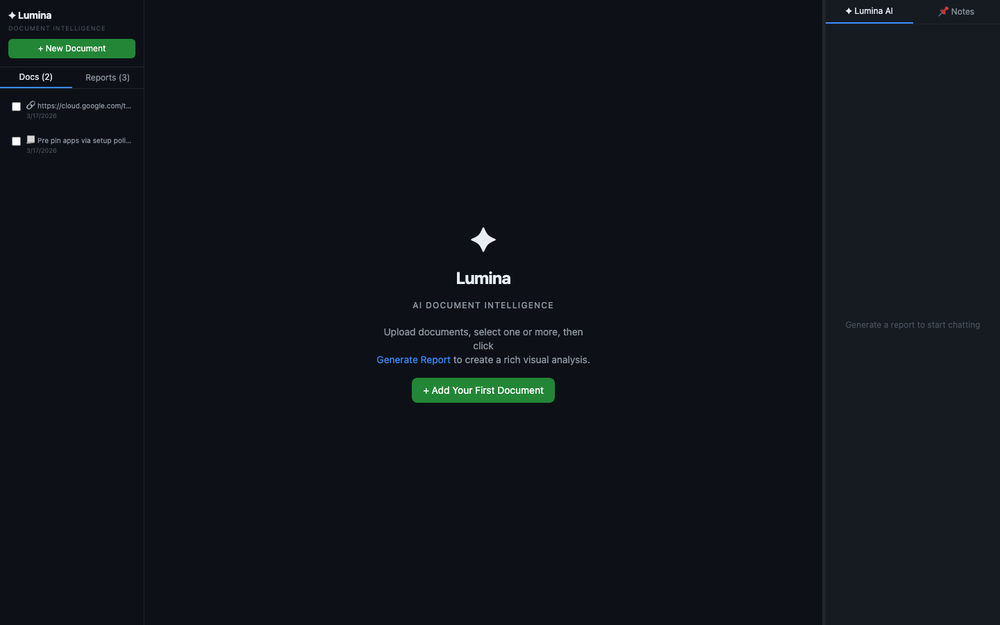
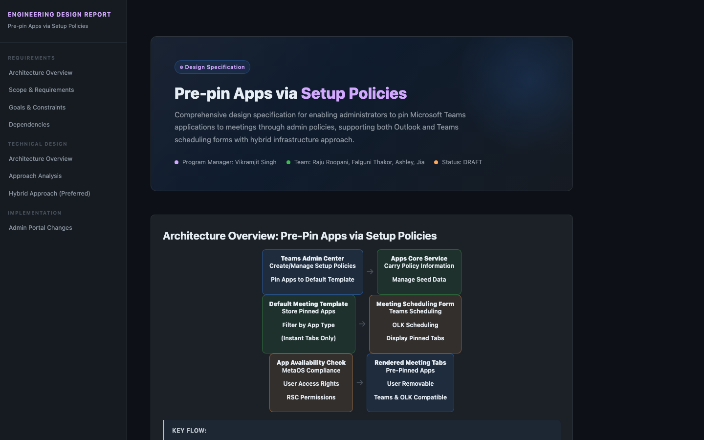

<div align="center">

# ✦ Lumina

### AI Document Intelligence

**Turn any document into a rich, interactive engineering report — in seconds.**
Ask questions. Request edits. Watch your report evolve with AI in real time.

<br/>

[](https://fastapi.tiangolo.com)
[](https://react.dev)
[](https://anthropic.com)
[](https://typescriptlang.org)
[](LICENSE)

<br/>

</div>

---

## What does it do?

Drop in a PDF, DOCX, URL, or raw text. Lumina's AI engine (powered by Claude) instantly generates a **production-grade visual engineering report** — complete with a sidebar navigator, architecture diagrams, sequence flows, comparison tables, stat cards, timelines, and more. Zero templates. Zero manual formatting. Pure intelligence.

Then **chat with your document**. Ask *"what are the main risks?"* and get a precise answer. Say *"expand the architecture section and add a sequence diagram"* — watch the report update live, right in front of you.

---

## Screenshots

<table>
<tr>
<td align="center" width="50%">

**Landing — clean, dark, focused**



</td>
<td align="center" width="50%">

**Report View — AI-generated architecture diagram**



</td>
</tr>
</table>

> Reports include: architecture box diagrams, sequence flows, timeline cards, stat grids, risk callouts, comparison tables — all generated from your document content.

---

## ✦ Features

| | Feature | What it does |
|---|---------|-------------|
| ⚡ | **Instant Reports** | Claude generates a complete styled HTML report with sidebar, sections, and diagrams in ~3 seconds |
| 💬 | **Live AI Chat** | Stream answers in real time — user messages appear instantly, no blank flashes |
| ✏️ | **Section Editing** | Say *"add a sequence diagram to architecture"* — Claude calls a native tool to rewrite the section |
| 🏗️ | **Architecture Diagrams** | CSS-native box flow diagrams — no Mermaid, no external dependencies, works offline |
| 🔀 | **Sequence Diagrams** | Multi-actor request/response flows for API and system interaction documentation |
| 📄 | **Multi-Document Analysis** | Select 2+ docs → comparison, synthesis, and cross-document insights |
| 🔁 | **Retro Loop** | System learns from every interaction — each report is better than the last |
| 🗑️ | **Delete & Manage** | Delete documents and reports with hover-reveal controls |
| ↔️ | **Resizable Chat Panel** | Drag the handle to resize the AI chat panel — zero-jank, direct DOM mutation |

---

## How it works

### 1. Upload

Drop in any document — PDF, DOCX, URL, or plain text. Lumina extracts the full text and stores it for analysis.

### 2. Generate

Click **Generate Report**. Lumina streams progress updates while Claude writes a complete HTML page — with sidebar navigation, hero section, architecture diagrams, risk callouts, comparison tables, and more. The prompt is augmented with **retro-loop hints** from your previous reports to improve quality over time.

### 3. Chat & Edit

Open the ✦ Lumina AI panel. Ask anything about the document. Request changes:

```
"Add a sequence diagram showing the API call flow"
"Expand the risks section with mitigations for each item"
"Create a comparison table of Approach A vs Approach B"
```

Claude calls the `update_section` tool — the exact HTML section is rewritten and saved to the database. The report re-renders instantly.

---

## Architecture

```
┌───────────────────────────────────────────────────────────────────┐
│                        React Frontend                              │
│                                                                    │
│  ┌─────────────────┐  ┌────────────────────┐  ┌───────────────┐  │
│  │  HistorySidebar  │  │   ReportViewer      │  │  ✦ Lumina AI  │  │
│  │  (docs/reports)  │  │   (srcdoc iframe)   │  │  (chat panel) │  │
│  └────────┬─────────┘  └────────┬───────────┘  └──────┬────────┘  │
└───────────┼─────────────────────┼────────────────────┼────────────┘
            │ REST                │ React Query         │ SSE stream
┌───────────▼─────────────────────▼────────────────────▼────────────┐
│                        FastAPI Backend                              │
│   /api/documents    /api/reports    /api/chat                      │
└───────────────────────────┬────────────────────────────────────────┘
                            │
              ┌─────────────┴──────────────────┐
              │                                 │
    ┌─────────▼──────────┐      ┌───────────────▼────────┐
    │  Claude Haiku API   │      │  SQLite + learnings.   │
    │  (reports + chat)   │      │  json (retro loop)     │
    └─────────────────────┘      └────────────────────────┘
```

**Report pipeline:**
```
Upload → text extraction → Claude (16k tokens + CSS template + retro hints)
       → post-process (strip orphan nav links, inject smooth-scroll JS)
       → SQLite → sandboxed srcdoc iframe with IntersectionObserver nav
```

**Chat pipeline:**
```
User types → optimistic render (instant)
           → Claude with report context + section IDs + tool definition
           → if edit → update_section tool call → PATCH /api/reports/:id/section
           → iframe re-renders → retro loop records which sections get edited
```

---

## Visual Component Library

Reports use a **pure CSS component system** — no Mermaid, no CDN, no external chart libraries. Works fully offline and in sandboxed iframes.

| Component | CSS Class | Use When |
|-----------|-----------|----------|
| Box Flow Diagram | `.box-row .box .arrow` | Service architecture, data pipelines |
| Sequence Diagram | `.seq-diagram .seq-actor .seq-msg` | API call chains, request/response flows |
| Timeline | `.timeline .tl-item` | Implementation phases, milestones |
| Approach Cards | `.approach-card .preferred-badge` | Comparing options with trade-offs |
| Stat Grid | `.stat-grid .stat-card` | KPIs, metrics, key numbers |
| Pro/Con Grid | `.pro-con-grid .pro-card .con-card` | Decision analysis |
| Callouts | `.callout-info\|warn\|danger\|success` | Highlights, warnings, tips |
| Pills | `.pill .pill-blue\|green\|red\|purple` | Status labels, categories |

---

## Retro Loop

Lumina compounds quality with every report you generate:

```
After each report generation:
  → count sections generated
  → detect which CSS components were used

After each AI chat edit:
  → record which section was updated

_refresh_hints() derives rules like:
  • "Average 6 sections — target 9–12 for depth"
  • ".seq-diagram never appeared — use it"
  • "Users edit 'architecture' most — make it rich upfront"

Hints injected into every subsequent report generation.
Quality improves automatically.
```

Stats persist in `backend/learnings.json`.

---

## Getting Started

### Prerequisites

- Python 3.9+
- Node.js 18+
- An [Anthropic API key](https://console.anthropic.com)

### Backend

```bash
cd backend
python3 -m venv .venv && source .venv/bin/activate
pip install -r requirements.txt

echo "ANTHROPIC_API_KEY=sk-ant-..." > .env

python3 -m uvicorn main:app --reload --port 8000
```

### Frontend

```bash
cd frontend
npm install
npm run dev
```

Open **[http://localhost:5173](http://localhost:5173)** ✦

---

## Tech Stack

| Layer | Technology |
|-------|-----------|
| **AI** | Anthropic Claude `claude-haiku-4-5`, native tool use |
| **Backend** | Python 3.9+, FastAPI, SQLAlchemy, SQLite |
| **Document Parsing** | PyMuPDF, python-docx, BeautifulSoup4, httpx |
| **Frontend** | React 19, TypeScript, Vite, TailwindCSS v4 |
| **State / Fetching** | @tanstack/react-query v5, SSE streaming |

---

## Project Structure

```
lumina-ai/
├── backend/
│   ├── main.py                   # FastAPI app entry point
│   ├── models.py                 # ORM models + Pydantic schemas
│   ├── routers/
│   │   ├── documents.py          # Upload, list, delete
│   │   ├── reports.py            # Generate, view, patch sections, delete
│   │   └── chat.py               # SSE stream + compare endpoint
│   ├── services/
│   │   ├── report_service.py     # Claude report generation + post-processing
│   │   ├── chat_service.py       # Claude chat with native tool use
│   │   └── learnings_service.py  # Retro loop — tracks stats, derives hints
│   └── prompts/
│       ├── report_prompt.py      # CSS template + component reference
│       └── chat_prompt.py        # Chat system prompt with component guide
└── frontend/
    └── src/
        ├── App.tsx               # Root layout + report generation
        ├── components/
        │   ├── HistorySidebar/   # Docs + reports list with delete
        │   ├── ReportViewer/     # Sandboxed iframe renderer
        │   └── ChatPanel/        # AI chat panel with resize + markdown
        └── hooks/
            └── useChat.ts        # Local message state + SSE streaming
```

---

## License

MIT — use it, fork it, ship it.

---

<div align="center">

Built with [Claude](https://anthropic.com) · Powered by curiosity

*✦ Lumina — because documents deserve better than ctrl+F*

</div>
